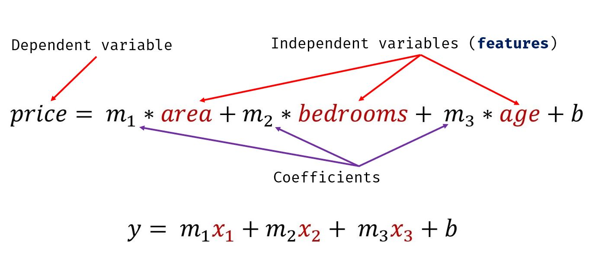

# Predicción del Precio de Viviendas con Regresión Lineal Múltiple

Este proyecto utiliza regresión lineal múltiple para predecir los precios de las viviendas en Monroe, Nueva Jersey (EE. UU.), basándose en el área (pies cuadrados), el número de habitaciones y la antigüedad de la vivienda.

## Problema de Ejemplo

Se proporciona un conjunto de datos con los precios de las viviendas en Monroe Twp, NJ. El objetivo es predecir los precios de nuevas viviendas dadas sus características.

La tabla de datos de ejemplo es la siguiente:

| Área (pies cuadrados) | Habitaciones | Antigüedad (años) | Precio   |
| -------------------- | ----------- | --------------- | -------- |
| 2600                 | 3           | 20              | 550000   |
| 3000                 | 4           | 15              | 565000   |
| 3200                 | NaN         | 18              | 610000   |
| 3600                 | 3           | 30              | 595000   |
| 4000                 | 5           | 8               | 760000   |
| 4100                 | 6           | 8               | 810000   |

Dado estos precios de vivienda, el proyecto calcula el precio de una vivienda que tiene:

* 3000 pies cuadrados de área, 3 habitaciones y 40 años de antigüedad.
* 2500 pies cuadrados de área, 4 habitaciones y 5 años de antigüedad.

## Modelo

Se utiliza la regresión con múltiples variables, donde el precio se calcula mediante la siguiente ecuación:

## Preprocesamiento de Datos

Los valores faltantes en el conjunto de datos se rellenan con la mediana de la columna correspondiente.

## Resultados

* Precio de la vivienda con 3000 pies cuadrados, 3 habitaciones y 40 años de antigüedad: **\$498408.25**
* Precio de la vivienda con 2500 pies cuadrados, 4 habitaciones y 5 años de antigüedad: **\$578876.04**

## Cómo usar

1.  **Clona el repositorio:** `git clone <URL_del_repositorio>`
2.  **Instala las dependencias:** `pip install -r requirements.txt`
3.  **Ejecuta la aplicación Streamlit:** `streamlit run viviendas_streamlit.py`

## Archivos Incluidos

* `homeprices.csv`:  El conjunto de datos de precios de la vivienda.
* `prediccion_vivienda.ipynb`:  El notebook de Jupyter con el código de análisis.
* `viviendas_streamlit.py`:  La aplicación Streamlit para la predicción interactiva.
* `requirements.txt`:  Lista de dependencias de Python.

## Dependencias

* pandas
* scikit-learn
* streamlit
* numpy

## Autor

[Horacio Adrián Roja]

